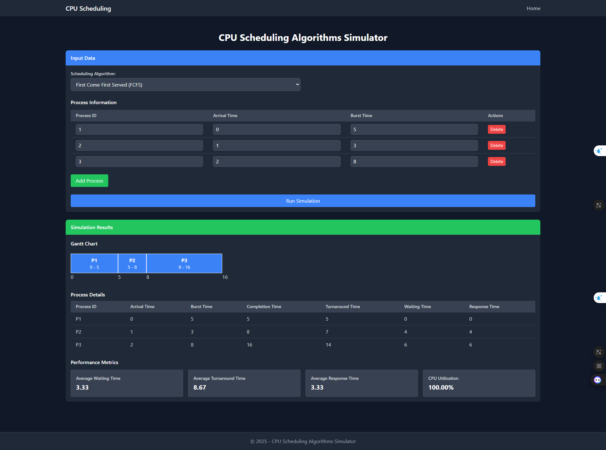

# CPU Scheduling Simulator

A web-based application for simulating and visualizing CPU scheduling algorithms, built with ASP.NET Core and Tailwind CSS.



## Overview

This CPU Scheduling Simulator is an educational tool designed to demonstrate how different CPU scheduling algorithms work in operating systems. Through an intuitive web interface, users can visualize the execution sequence and performance metrics of various scheduling algorithms using interactive Gantt charts and detailed process statistics.

## Features

- Simulation of multiple CPU scheduling algorithms:

  - **First Come First Served (FCFS)**: Non-preemptive algorithm that executes processes in order of arrival
  - **Shortest Job First (SJF)**: Non-preemptive algorithm that prioritizes processes with the shortest burst time
  - **Shortest Remaining Time (SRT)**: Preemptive version of SJF that switches to processes with shorter remaining time
  - **Priority Scheduling**: Non-preemptive algorithm that executes processes based on their priority values
  - **Round Robin**: Preemptive algorithm that allocates a fixed time quantum to each process in a cyclic manner

- Interactive interface for:

  - Adding, editing, and removing processes
  - Setting process parameters (ID, arrival time, burst time, priority)
  - Configuring time quantum for Round Robin scheduling
  - Visualizing process execution using dynamic Gantt charts

- Comprehensive performance metrics:
  - Average waiting time
  - Average turnaround time
  - Average response time
  - CPU utilization percentage

## Getting Started

### Prerequisites

- [.NET 9.0 SDK](https://dotnet.microsoft.com/download) or later
- [Node.js](https://nodejs.org/) and npm (for Tailwind CSS processing)

### Installation

1. Clone the repository:

   ```bash
   git clone https://github.com/YousefElbilkasy/CPUScheduling.git
   cd "Demo 3"
   ```

2. Install Node.js dependencies:

   ```bash
   cd CPUScheduling
   npm install
   ```

3. Build the Tailwind CSS:

   ```bash
   npm run build:css
   ```

4. Build and run the application:

   ```bash
   dotnet build
   dotnet run
   ```

5. Open your browser and navigate to:
   ```
   http://localhost:5246
   ```

## Usage Guide

### Configuring the Simulation

1. **Select a Scheduling Algorithm**:

   - Choose from the dropdown menu: FCFS, SJF, SRT, Priority, or Round Robin
   - For Round Robin, specify a time quantum value (default is 2)

2. **Define Processes**:

   - Add processes using the "Add Process" button
   - For each process, specify:
     - Process ID: Unique identifier for each process
     - Arrival Time: When the process arrives in the ready queue
     - Burst Time: Total CPU time required by the process
     - Priority: Process priority (only used in Priority Scheduling, lower value = higher priority)

3. **Run the Simulation**:
   - Click "Run Simulation" to execute the selected algorithm
   - View the results in the Gantt chart and performance metrics sections

### Interpreting Results

1. **Gantt Chart**: Shows the execution sequence of processes over time

   - Process blocks show which process is running at each time unit
   - Idle blocks indicate when the CPU is not processing any task
   - Time markers show the start and end times of each execution block

2. **Process Details Table**: Displays the calculated metrics for each process

   - Completion Time: When the process finishes execution
   - Turnaround Time: Total time from arrival to completion (Completion Time - Arrival Time)
   - Waiting Time: Time spent waiting for CPU (Turnaround Time - Burst Time)
   - Response Time: Time until first CPU allocation (First execution start time - Arrival Time)

3. **Performance Metrics**: Provides algorithm efficiency indicators
   - Average Waiting Time: Mean time processes spend waiting
   - Average Turnaround Time: Mean time from arrival to completion
   - Average Response Time: Mean time until first CPU allocation
   - CPU Utilization: Percentage of time the CPU is busy processing

## Project Structure

```
CPUScheduling/
├── Controllers/          # MVC controllers
│   └── HomeController.cs # Main controller for handling simulation requests
├── Models/               # Data models
│   ├── Process.cs        # Process entity with timing attributes
│   ├── GanttChartItem.cs # Represents execution blocks in the Gantt chart
│   ├── SchedulingAlgorithm.cs # Enum defining available algorithms
│   └── SchedulingResult.cs # Container for simulation results
├── ViewModels/           # Presentation models
│   ├── ErrorViewModel.cs # Error handling data model
│   └── SchedulingViewModel.cs # Main view data container
├── Services/             # Business logic
│   └── SchedulingService.cs # Implementation of scheduling algorithms
├── Views/                # Razor views
│   ├── Home/
│   │   └── Index.cshtml  # Main simulation interface
│   └── Shared/           # Shared layout elements
├── wwwroot/              # Static files
│   ├── css/              # Stylesheets
│   └── js/               # JavaScript files
└── Program.cs            # Application entry point and configuration
```

## Algorithm Implementation Details

### First Come First Served (FCFS)

- Processes are executed strictly in order of their arrival times
- Simple implementation with no preemption
- Potential for "convoy effect" where short processes wait behind long ones

### Shortest Job First (SJF)

- Selects the process with the shortest burst time from available processes
- Optimal for minimizing average waiting time (when all processes arrive simultaneously)
- Non-preemptive implementation

### Shortest Remaining Time (SRT)

- Preemptive version of SJF
- Switches to a newly arrived process if it has a shorter remaining execution time
- Requires tracking remaining execution time for all processes

### Priority Scheduling

- Processes are executed based on priority values
- Lower number indicates higher priority
- Non-preemptive implementation (process runs to completion once started)

### Round Robin

- Each process gets a fixed time slice (quantum) in a cyclic manner
- Preemptive algorithm - context switches occur when time quantum expires
- Good for fair CPU time distribution among processes

## Technology Stack

- [ASP.NET Core 9.0](https://docs.microsoft.com/aspnet/core) - Web application framework
- [Tailwind CSS](https://tailwindcss.com/) - Utility-first CSS framework
- [jQuery](https://jquery.com/) - JavaScript library for DOM manipulation
- [C#](https://docs.microsoft.com/en-us/dotnet/csharp/) - Programming language

## License

This project is licensed under the MIT License - see the LICENSE file for details.

## Acknowledgments

- Developed as an educational project for Operating Systems course
- Based on CPU scheduling algorithms described in operating systems literature
- UI design inspired by modern dark-mode dashboards and monitoring tools
